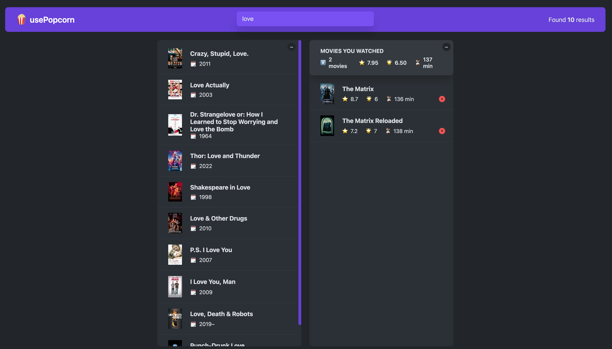
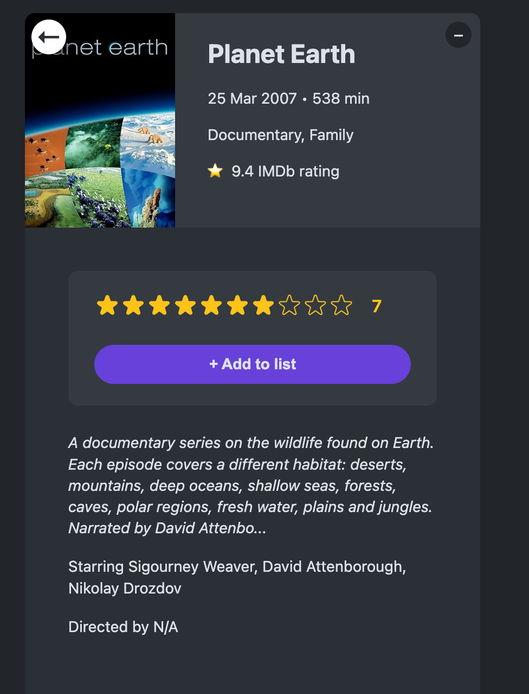
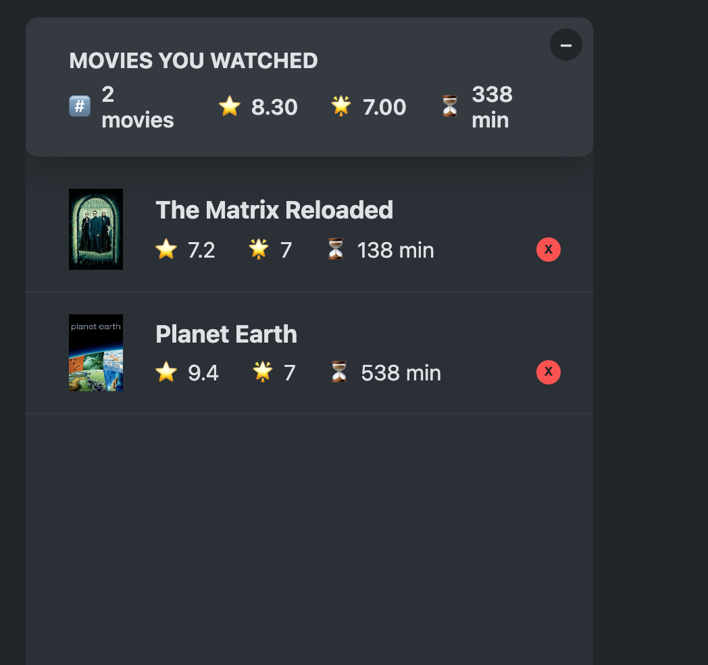
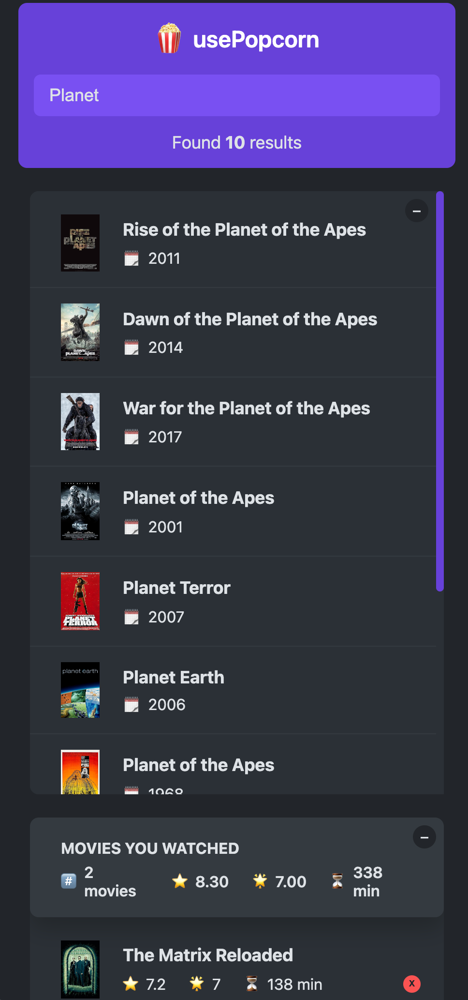

# Popcorn - Movie Search and Watchlist App

A React-based movie application that allows users to search for movies and manage their personal watchlist. The app uses the OMDB (Open Movie Database) API to fetch comprehensive movie data from IMDB.

## Screenshots

### Desktop View


_Main search interface with movie results_


_Detailed view of a selected movie_


_Personal watchlist with rated movies_

### Mobile View


_Responsive mobile interface_

## Features

- **Movie Search**: Search for movies using the OMDB API
  - Access to the extensive IMDB movie database
  - Real-time search results
  - Detailed movie information including ratings, year, and runtime
- **Movie Details**: View detailed information about each movie
- **Star Rating System**: Rate movies with an interactive star rating component
- **Watchlist Management**:
  - Add movies to your watchlist
  - Delete movies from your watchlist
  - View your watched movies summary
- **Local Storage**: Your watchlist persists between sessions
- **Responsive Design**: Modern and user-friendly interface

## Technical Features

- Built with React 18
- Custom React Hooks:
  - `useMovies`: Handles movie data fetching
  - `useKey`: Manages keyboard events
  - `useLocalStorageState`: Handles local storage state management
- Modern ES6+ JavaScript
- CSS for styling
- Integration with OMDB API for movie data

## Getting Started

1. Clone the repository
2. Install dependencies:
   ```bash
   npm install
   ```
3. Start the development server:
   ```bash
   npm start
   ```

## Dependencies

- React 18.2.0
- React DOM 18.2.0
- React Testing Library
- Web Vitals

## API Integration

The app uses the OMDB API (Open Movie Database) which provides access to IMDB's extensive movie database. You'll need an API key from [OMDB](http://www.omdbapi.com/) to run the application locally.
